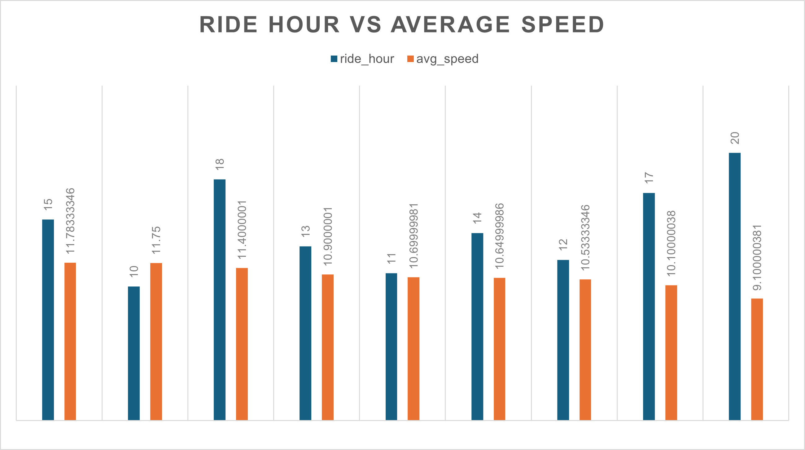
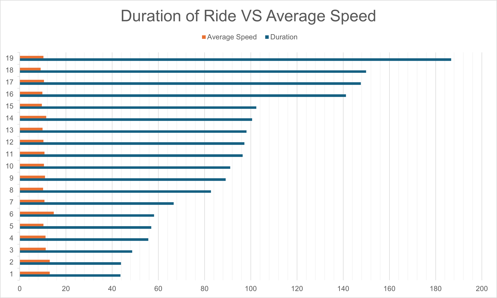
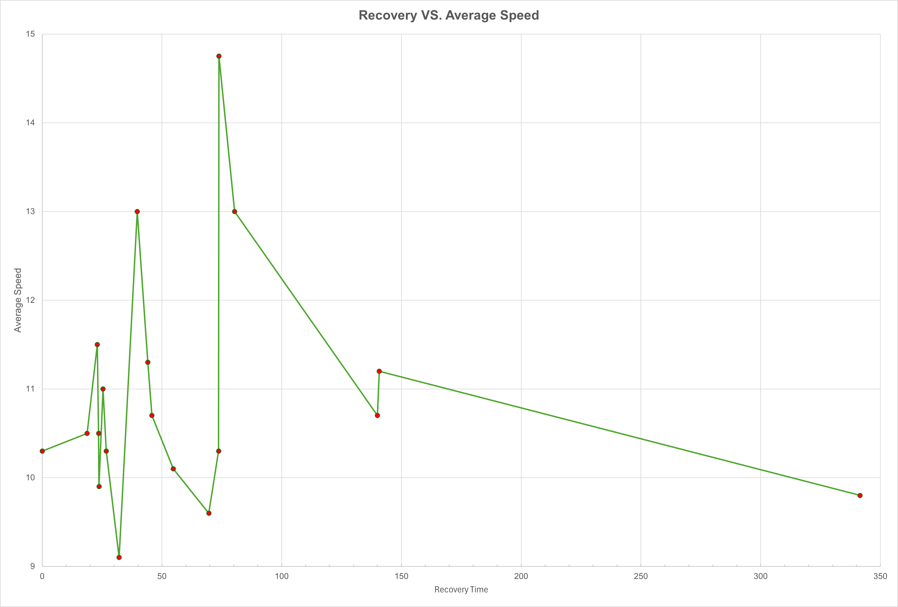

# **Health Data Analysis**  

## **Context**  
In 2022, I increased my efforts at staying active and logged 19 bike rides on my Apple watch between May and June. I wanted to analyze these rides to identify any patterns in what impacted my performance and if I had improved over my rides.  

To complete this, using the SQLAlchemy package through Python as well as assistance from CoPilot and ChatGPT, I created a MySQL database consisting of the data from my Apple Watch, specifically, my heart rate, average speed, elevation gain, and calories burned. Using this database, I was able to perform calculations using SQL commands to gather information such as my best ride times, my intensity per session, if recovery time influenced my performance, and if the longer I rode the more or less efficient I rode.  

## **Analysis**  
To track my performance and trends within my data, I used SQL queries to link contributing factors together.  

### **Time of Day vs. Speed**  
I initially believed I would find a strong link with the time of day that I rode my bike to my highest speed and I calculated this using:  
``` sql
HOUR(date_time), AVG(avg_speed);
```

| Ride Hour | Avg Speed  |
|-----------|-----------|
| 15        | 11.78333346 |
| 10        | 11.75      |
| 18        | 11.4000001 |
| 13        | 10.9000001 |
| 11        | 10.69999981 |
| 14        | 10.64999986 |
| 12        | 10.53333346 |
| 17        | 10.10000038 |
| 20        | 9.100000381 |

This proved inconclusive as most values were extremely close, such as my best speed at 3 PM being nearly identical to 10 AM.



## Distance vs Ride Intensity
Looking at other potential links, Ride Intensity (calculated earlier to standardize effort to not introduce categorical bias with higher totals such as elevation gain) was selected with distance to reveal a link between more intense rides and longer distances.
```sql 
SELECT date_time, distance, ride_intensity 
FROM cycling_data 
ORDER BY ride_intensity 
DESC LIMIT 10
```
| Date & Time         | Distance | Ride Intensity |
|---------------------|----------|---------------|
| 5/26/2022 15:55    | 32.2     | 173.867       |
| 6/22/2022 18:41    | 26.3     | 158.567       |
| 5/15/2022 10:46    | 26.07    | 153.067       |
| 5/29/2022 20:11    | 22.81    | 147.7         |
| 6/8/2022 13:12     | 19.34    | 133.1         |
| 6/2/2022 12:27     | 17.36    | 128.067       |
| 6/7/2022 14:11     | 16.49    | 120.433       |
| 6/6/2022 12:47     | 16.55    | 120.133       |
| 6/3/2022 15:12     | 16.75    | 118.433       |
| 5/30/2022 14:55    | 16.06    | 116.367       |

This gave my most concrete performance link, however, this was not indicative of a performance gain over time as data showed that my first ride was my most intense.


### Duration vs. Speed 
This led me to change my expectations and search for a link between speed and duration of my ride which was done using:
```sql 
AVG(avg_speed) GROUP BY duration;
```
| Duration  | Average Speed  |
|-----------|---------------|
| 43.6      | 13            |
| 43.85     | 13            |
| 48.7167   | 11.30000019   |
| 55.6333   | 11.19999981   |
| 56.9667   | 10.30000019   |
| 58.2      | 14.75         |
| 66.6667   | 10.69999981   |
| 82.7667   | 10.10000038   |
| 89.1833   | 11            |
| 91.1167   | 10.5          |
| 96.5167   | 10.69999981   |
| 97.2833   | 10.30000019   |
| 98.1833   | 9.899999619   |
| 100.567   | 11.5          |
| 102.433   | 9.600000381   |
| 141.233   | 9.800000191   |
| 147.65    | 10.5          |
| 149.883   | 9.100000381   |
| 186.717   | 10.30000019   |

This new hypothesis proved faulty as well. Although several of my shorter rides were ranked at the top, the data was inconclusive as the middle section showed no link.


### Recovery Time vs. Speed

Lastly, I looked at my ride dates and determined that there must be a link between time between rides. Unfortunately, after running the query:
```sql
AVG(avg_speed) GROUP BY hours_since_last_ride;
```
| Hours Since Last Ride | Average Speed  |
|----------------------|---------------|
| 0                   | 10.30000019   |
| 18.7333            | 10.5          |
| 23.0167            | 11.5          |
| 23.5667            | 10.5          |
| 23.7333            | 9.899999619   |
| 25.4               | 11            |
| 26.75              | 10.30000019   |
| 32.15              | 9.100000381   |
| 39.7               | 13            |
| 44.1167            | 11.30000019   |
| 45.8               | 10.69999981   |
| 54.7333            | 10.10000038   |
| 69.5833            | 9.600000381   |
| 73.6667            | 10.30000019   |
| 73.8167            | 14.75         |
| 80.3333            | 13            |
| 140                | 10.69999981   |
| 140.75             | 11.19999981   |
| 341.483           | 9.800000191   |

This showed no correlation between the two leading me to believe that my performance was not impacted by anything other than external factors such as my psychological state or the weather.

