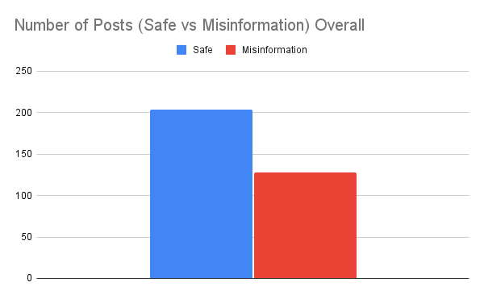
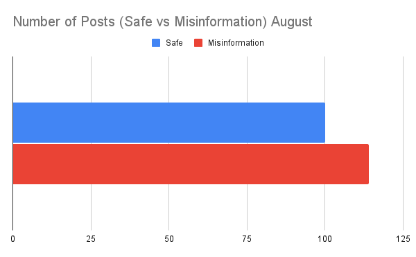
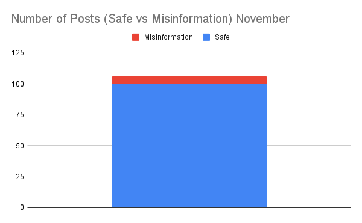

# Mpox Post Misinformation Analysis

## Technology
- Python 
- Excel  

## Skills Used
- Data Cleaning 
- Web Scraping
- Technical Writing  

## Context 
This study examines the discourse surrounding Mpox across the X platform using Python to scrape posts over three months to build a database of time-stamped posts along with their contents and unique user handles. Findings are analyzed by comparing past instances of information and misinformation during global health crises to categorize and analyze similarities and evolutions in a post-COVID context. Our findings identify troubling misinformation trends as well as how Mpox differs from those prior providing valuable data in the public global health information sector. This data has the potential to improve comprehension of misinformation spread as well as aid in revamping the distribution of accurate information during future health crises to curb misinformation.  

### Data Collection  
To gather our data, we utilized the Twikit Python package which uses user cookie data to authenticate automated requests sent to X without using the paid API from late August to November 2024. We chose to query using the terms “Mpox”, and “MonkeyPox” and filter our results to obtain the top posts marked as English from late August to November 2023.  

By the end of our data collection, we obtained over 5000 posts, however, after filtering out replies we were left with around 400 tweets, which is a reasonable size of what a regular user may have viewed in the top posts section over this timeframe.  

## Analysis & Findings  
Following our collection, we created a rigorous coding process to identify posts as harmful, potentially harmful, and safe along with 22 categorical descriptors and 8 contextual labels for legibility and continuity.  

We observed an alarming amount of misinformation posts throughout our study with over 120 marked as misinformation (consisting of harmful and potentially harmful). 

### Misinformation Evolution  
Looking at the data more closely, we identified a similarity to the Ebola crisis, where the spread of misinformation occurred overwhelmingly at the onset with 114 instances occurring in August.

November showed a mere 6. 

### Key Topics Seen 
| Misinformation Classifier       | Percentage  |
|---------------------------------|------------|
| False Claims                    | 34.06%     |
| Vaccine                          | 29.67%     |
| Pharma                           | 19.78%     |
| LGBTQ+                           | 17.58%     |
| Planned Pandemic                 | 15.38%     |
| World Government                 | 11%        |
| News Authenticity                | 8.7%       |
| Bill Gates                       | 7.7%       |
| Threat to Public Figure/Group    | 6.6%       |
| Election Fraud                   | 5.5%       |
| Others                           | 1%         |

- Of the over 120 instances, there was a clear bias towards vaccine misinformation.  
- Most frighteningly, our general false claims descriptor was given to posts that were ripe with misinformation but did not fit directly into any previously defined categories showing topical evolution as well.  

### Conclusion  
Although misinformation in the Mpox era did not command the same footing as it had in more polarizing cases such as COVID, it is evolving at a rapid rate and spreading early on, revealing an earnest need for public health officials to monitor new instances of misinformation and combat even those that do not fall under conventional categories.  
